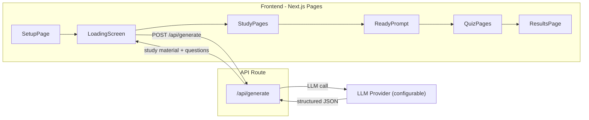

# Kids AI Study App

## Tech Stack

- **Framework**: Next.js 14 (App Router) -- single project with API routes, no separate backend needed
- **Styling**: Tailwind CSS -- fast responsive/mobile-first design
- **Animations**: Framer Motion -- kid-friendly transitions, confetti, progress animations
- **LLM Integration**: Vercel AI SDK (`ai` package) -- supports OpenAI, Anthropic, Google Gemini via a unified interface; provider is selected through env config
- **State Management**: React Context + `useReducer` -- lightweight, sufficient for session-based app
- **No database** -- all state lives in the browser session; no auth needed

## Architecture



## Project Structure

```
ai_kids_study/
  app/
    layout.tsx              # Root layout, fonts, global styles
    page.tsx                # Setup form (grade, subject, topic, question count)
    globals.css             # Tailwind + custom kid-friendly styles
    api/
      generate/
        route.ts            # API route: calls LLM, returns study material + questions
  components/
    SetupForm.tsx           # Grade/subject/topic/question-count form
    StudyViewer.tsx          # Paginated study material reader
    Quiz.tsx                # Quiz controller (one question at a time)
    QuestionCard.tsx         # Single question with multi-choice answers + check button
    ResultsScreen.tsx       # Score summary + improvement areas
    ProgressBar.tsx         # Visual progress indicator
    ReadyPrompt.tsx         # "Are you ready for the test?" transition
    LoadingAnimation.tsx    # Fun animated loading screen
  context/
    StudyContext.tsx         # App-wide state: study material, questions, answers, score
  lib/
    prompts.ts              # LLM prompt templates for generating content
    types.ts                # TypeScript types for study material, questions, etc.
  public/
    (static assets)
  .env.local                # LLM provider config (API key, model name)
  tailwind.config.ts
  package.json
```

## Key Types (`lib/types.ts`)

```typescript
type Grade = 'K' | '1' | '2' | '3' | '4' | '5';
type Difficulty = 'easy' | 'medium' | 'hard';

interface StudyPage {
  title: string;
  content: string;   // markdown-formatted, kid-friendly
}

interface Question {
  id: number;
  difficulty: Difficulty;
  question: string;
  choices: string[];
  correctIndex: number;
  explanation: string;
}

interface GenerateResponse {
  studyPages: StudyPage[];
  questions: Question[];
}
```

## Screen-by-Screen Plan

### 1. Setup Page (`app/page.tsx` + `SetupForm.tsx`)

- Large, colorful, touch-friendly form
- Grade selector: big buttons for K through 5
- Subject selector: icon buttons (Math, Science, Reading, Social Studies, etc.)
- Text input: "What do you want to learn about?" with placeholder examples
- Number input: "How many questions?" (slider or stepper, range 5-20, default 10)
- Big "Start Learning!" button

### 2. Loading Screen (`LoadingAnimation.tsx`)

- Fires `POST /api/generate` with user selections
- Shows a fun animated character or spinner (Framer Motion)
- Displays encouraging messages ("Getting your lesson ready!", "Almost there!")

### 3. API Route (`app/api/generate/route.ts`)

- Reads `LLM_PROVIDER` and `LLM_API_KEY` from env
- Constructs a prompt requesting structured JSON output containing:
  - 3-4 pages of kid-friendly study material (adapted to grade level)
  - N multi-choice questions split 50% easy / 30% medium / 20% hard
- Uses Vercel AI SDK's `generateObject()` with a Zod schema for type-safe structured output
- Returns the parsed JSON to the client

### 4. Study Material Viewer (`StudyViewer.tsx`)

- Paginated card view -- one page at a time
- Large readable text, grade-appropriate vocabulary
- Page indicator dots + forward/back buttons (swipe support via touch events)
- Animated page transitions (slide left/right with Framer Motion)
- Final page has a "Ready for the Test?" button leading to ReadyPrompt

### 5. Ready Prompt (`ReadyPrompt.tsx`)

- Fun transition screen: "Are you ready to test what you learned?"
- Two buttons: "Let me review" (back to study) and "I'm ready!" (start quiz)
- Animated character or encouraging message

### 6. Quiz (`Quiz.tsx` + `QuestionCard.tsx`)

- Shows one question at a time with its difficulty badge (color-coded: green/yellow/red)
- 4 multiple-choice options as large tap-friendly buttons
- "Check Answer" button -- once clicked:
  - Correct answer highlights green with a celebratory animation
  - Wrong answer highlights red, correct answer highlights green
  - Explanation text appears below
  - Answer is locked (cannot change)
- Navigation: previous/next question buttons + question number indicator
- Question nav dots at top showing status: unanswered (gray), correct (green), incorrect (red)
- On reaching the last question, if any are unanswered, show a reminder banner

### 7. Results Screen (`ResultsScreen.tsx`)

- Confetti animation for good scores
- Score display: "You got X out of Y correct!" with a circular progress ring
- Breakdown by difficulty (easy/medium/hard performance)
- "Areas to improve" section based on incorrect answers -- groups wrong answers by concept
- "Try Again" and "Study Something New" buttons

## LLM Prompt Strategy (`lib/prompts.ts`)

The prompt will instruct the LLM to:

- Write at the reading level appropriate for the selected grade
- Use simple sentences, relatable examples, and encouraging tone
- Structure study material into clearly titled pages
- Generate questions that directly relate to the study material
- Distribute difficulty as requested (50/30/20)
- Provide clear, educational explanations for each answer

## Responsive / Mobile-First Design

- All touch targets minimum 44x44px
- Single-column layout optimized for portrait phone/tablet
- Large fonts (18-24px body text for readability)
- No hover-dependent interactions
- Swipe gestures for page navigation (study material + quiz)

## LLM Provider Configuration

Users set their provider in `.env.local`:

```
LLM_PROVIDER=openai        # or "anthropic" or "google"
LLM_API_KEY=sk-...
LLM_MODEL=gpt-4o           # optional, defaults per provider
```

The API route will dynamically select the provider using the AI SDK.

## Implementation Tasks

1. Scaffold Next.js project with Tailwind CSS, Framer Motion, Vercel AI SDK, and Zod dependencies
2. Create TypeScript types (`lib/types.ts`) and app state context (`context/StudyContext.tsx`)
3. Build the Setup page with grade, subject, topic, and question count form (kid-friendly, large touch targets)
4. Implement `/api/generate` route with LLM prompt engineering and structured JSON output via Vercel AI SDK
5. Create loading animation screen shown while LLM generates content
6. Build paginated study material viewer with page transitions and navigation
7. Create "Ready for the test?" transition screen
8. Build quiz flow: QuestionCard with check answer, lock, explanation, and question navigation
9. Build results screen with score, difficulty breakdown, improvement suggestions, and confetti animation
10. Final responsive/mobile polish, animations tuning, and end-to-end testing
